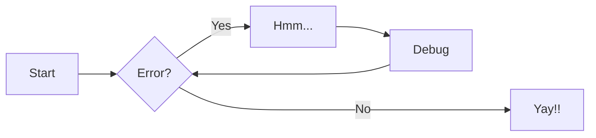

---
hide:
  - toc
---

# Welcome to my world!

This is the summary and notes of the work life for the past couple of years. I needed to find a way to make all of my notes and documents usable and searchable. I also needed a way to have a way to make documentation available for larger audience when needed so I started to do everything in Markdown. When I needed to build make everything available I found mkdocs....and here we are.

- For full documentation visit [mkdocs.org](https://www.mkdocs.org).
- This site uses an extension packaged named [mkdocs-material](https://squidfunk.github.io/mkdocs-material/)

## mkdoc Commands

- `mkdocs new [dir-name]` - Create a new project.
- `mkdocs serve` - Start the live-reloading docs server.
- `mkdocs build` - Build the documentation site.
- `mkdocs -h` - Print help message and exit.

## mkdocs project layout

    mkdocs.yml    # The configuration file.
    docs/
        index.md  # The documentation homepage.
        ...       # Other markdown pages, images and other files.

---

## My Markdown Notes

Hope that someone can benefit from my pain.

### Markdown Cheatsheets

- [Github Cheatsheet](https://github.com/adam-p/markdown-here/wiki/Markdown-Cheatsheet)
- [IBM Markdown Doc](https://www.ibm.com/docs/en/SSYKAV?topic=train-how-do-use-markdown)
- [Common Markdown](https://commonmark.org/help/)

### My Markdown Notes Examples and FAQ

#### Excluding MD text from prettier formatting in VSCode

````{ .md .copy title="Exclude MD from Prettier" }
<!-- prettier-ignore-start -->
<!-- SOMETHING AUTO-GENERATED BY TOOLS - START -->

<!-- SOMETHING AUTO-GENERATED BY TOOLS - END -->
<!-- prettier-ignore-end --```
````

#### Highlight and line numbers in code blocks

```{ .yaml linenums="1" hl_lines="6-7 12-15 20" title="install-config.yaml" .nocopy }
    additionalTrustBundlePolicy: Proxyonly
    apiVersion: v1
    baseDomain: gym.lan
    compute:
    - architecture: amd64
      hyperthreading: Enabled
      name: worker
      platform:
        vsphere:
          cpus: 8
          memoryMB: 16384
      replicas: 2
    controlPlane:
      architecture: amd64
      hyperthreading: Enabled
      name: master
      platform:
        vsphere:
          cpus: 4
          memoryMB: 16384
      replicas: 3
    metadata:
      creationTimestamp: null
      name: ocpinstall
```


#### Ordered list

1. ordered list
2. next item
     1. sub item 1
     2. sub item 1
3. next item
     1. sub item
         1. sub sub item
4. next item

#### Definition Lists

`Definition Lists`
: asdfadfadf

`second term`
: asdfasdfadf adsfadsffao

#### Task List

- [ ] action 1
- [x] action 2
- [ ] action 3
- [ ] action 4

##### Diagrams

- [mermaid.js](https://mermaid.js.org/syntax/flowchart.html)
- [more diagrams](https://squidfunk.github.io/mkdocs-material/reference/diagrams/)



- [D2](https://d2lang.com)

```d2
direction: right
x -> y: Hello World
```

